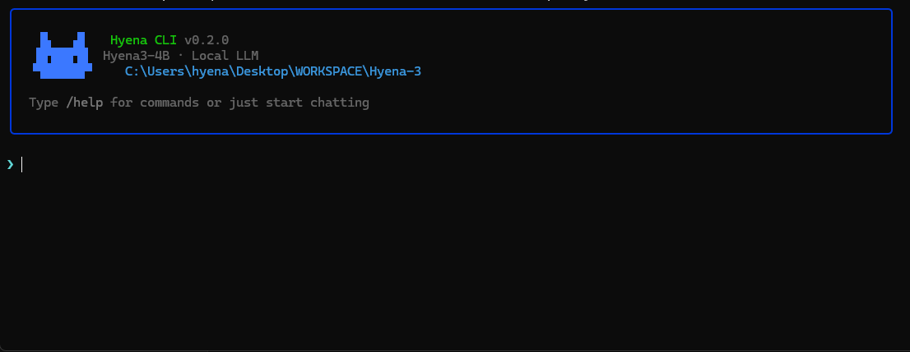
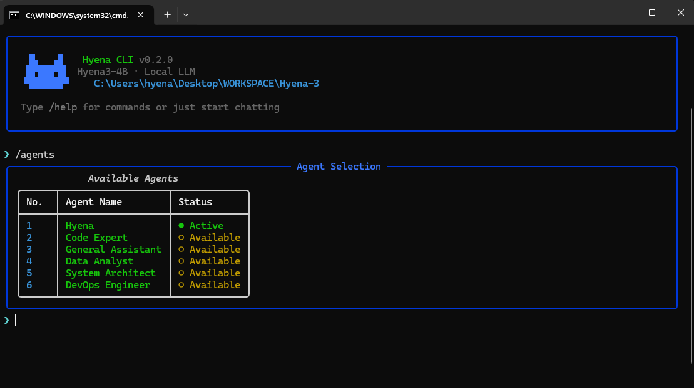
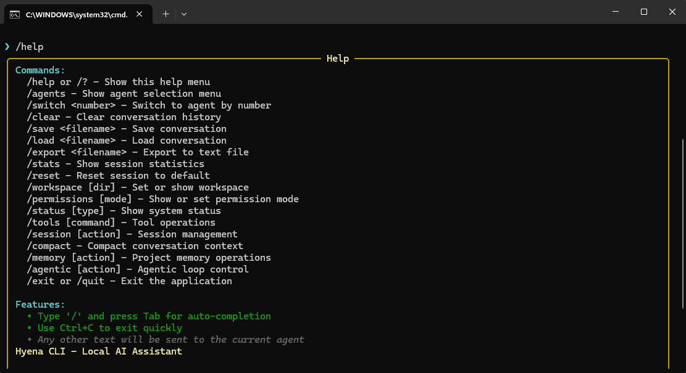
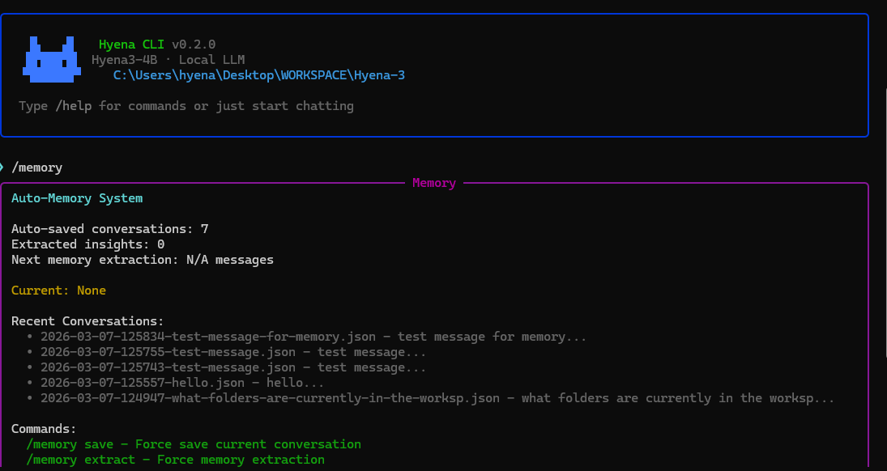
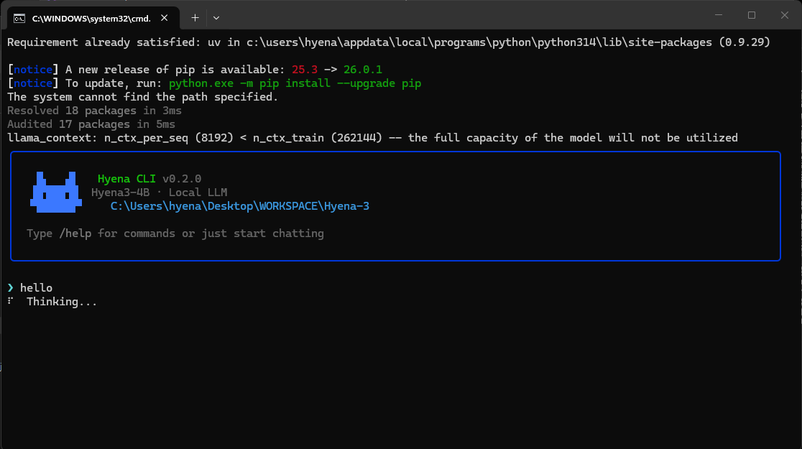

# Hyena AI CLI

[](https://www.python.org/downloads/)
[](LICENSE)
[](https://github.com/CosmonautCode/Hyena)
[](https://github.com/astral-sh/uv)
[](docs/)

A **lightweight, self-contained** Python CLI chat system with local AI agents and file operations. This system uses **[Hyena3-4B-Instruct](https://huggingface.co/microsoft/Hyena-3-4B-Instruct)** (Custom Qwen Fork) and **[llama-cpp-python](https://github.com/abetlen/llama-cpp-python)** for inference, with **[Rich](https://github.com/Textualize/rich)** for a **beautiful console interface**. Features AI agents with workspace-based file operations and dynamic terminal sizing. This has been a really fun side project and a nice addition to the tiny-local-llm ecosystem.



---

## Features

- **Auto-Memory System**: Conversations auto-save, AI extracts insights, context injects into prompts
- **Agentic Tool Loop**: AI plans and executes multi-step operations with tool calls
- **Local LLM**: Uses Hyena3-4B with llama-cpp-python for complete privacy
- **Rich Terminal UI**: Modern terminal interface with streaming responses and tool panels
- **Permission System**: Y/N/Always/Never approval for dangerous operations
- **No Manual Saves**: Everything auto-persists to `.hyena/` directory
- **Modular Architecture**: 22 focused modules under 200 lines each
- **PEP 8 Compliant**: Google standards to make life easy

---

## Quick Start

```bash
# Clone and setup
git clone <repository>
cd Hyena-3
uv sync

# Run the application
uv run python -m app.app

# Or use the batch file
run_app.bat
```

**Requirements:**
- Python 3.10+
- UV package manager
- Hyena3-4B model (auto-downloaded)

---

## How It Works

### Auto-Memory System
Every conversation is automatically persisted without manual `/save` commands.

1. **Auto-Save**: Each message saved to `.hyena/conversations/auto/`
2. **Insight Extraction**: Every 5 messages, AI extracts key facts and decisions
3. **Context Injection**: Relevant memories automatically added to system prompt
4. **Memory Commands**: `/memory list`, `/memory load`, `/memory delete`

### Agentic Tool Loop
When you ask the AI to perform operations:

1. **Gather**: AI analyzes your request and available context
2. **Plan**: Creates step-by-step execution plan with tool calls
3. **Act**: Executes tools (read_file, write_file, bash, etc.)
4. **Verify**: Checks results and retries if needed
5. **Display**: Tool calls and results shown in bordered panels

### Permission System
Dangerous operations require approval:

- **Always Safe**: Read, Glob, Grep (auto-approve)
- **Needs Approval**: Write, Edit, Bash, WebFetch (prompt user)
- **Modes**: auto/smart/always-ask

---

## Directory Structure

```
Hyena-3/
├── app/                    # Main application
│   ├── core/              # Chat system, commands, conversations
│   │   ├── chat/          # Chat functionality mixins
│   │   └── commands/      # Command processing system
│   ├── memory/            # Auto-memory, extraction, retrieval
│   │   ├── orchestrator/  # Memory coordination
│   │   ├── project/       # Project-specific memory
│   │   └── retrieval/     # Smart memory retrieval
│   ├── agents/            # Agentic loop, tools, permissions
│   │   ├── loop/          # Gather -> Plan -> Act -> Verify
│   │   └── tools/         # File, shell, workspace tools
│   ├── ui/                # Terminal interface
│   ├── workspace/         # File operations
│   ├── utils/             # Git, terminal helpers
│   └── llm/               # Model engine
├── docs/                  # Comprehensive documentation
│   ├── api/               # API reference
│   ├── guides/            # Development guides
│   └── architecture/      # System architecture
└── README.md              # This file
```

---

## Configuration

### Agents
Edit `app/data/agents.json` to customize AI personalities:

```json
{
  "agents": [
    {
      "name": "Code Expert",
      "specialty": "Programming and debugging",
      "system_prompt": "You are an expert programmer..."
    }
  ]
}
```

### Memory Settings
- Auto-save: Every message
- Extraction interval: Every 5 messages (configurable)
- Max stored memories: 100 (prunes oldest)

### Permission Modes
```python
# In app/agents/permission_system.py
class PermissionMode(Enum):
    ASK = "ask"          # Prompt for dangerous operations
    AUTO = "auto"        # Auto-accept safe operations, ask for dangerous ones
```

---

## Commands

| Command | Description |
|---------|-------------|
| `/help` | Show all available commands |
| `/agents` | List available AI personalities |
| `/switch <n>` | Switch to agent number n |
| `/memory` | Show memory status and recent conversations |
| `/memory list` | List all saved conversations |
| `/memory load <file>` | Load a conversation |
| `/workspace <dir>` | Set working directory |
| `/tools` | List available tools |
| `/agentic` | Agentic loop management |
| `/session` | Session management |
| `/compact` | Compact conversation history |
| `/clear` | Clear screen |
| `/status` | System status overview |

---

## Architecture

### Core Flow
```
User Input -> ChatSystem -> AutoMemory -> LLM -> Response
                ↓
           Tool Calls -> AgenticLoop -> Tool Execution
                ↓
           Permission Check -> User Approval (if needed)
```

### Memory Flow
```
Message -> ConversationStore -> Auto-save to disk
            ↓
        Every 5 messages -> MemoryExtractor -> Structured insights
            ↓
        MemoryRetrieval -> Context injection -> Enhanced prompt
```

### Agentic Loop
```
Gather Context -> Create Plan -> Execute Tools -> Verify Results
      ↓              ↓              ↓              ↓
  User Input    AI Planning    Tool Calls    Result Check
```

---

## Screenshots

### System Startup


### Available Agents  


### Commands Help


### Memory Management


### AI Thinking


---

## Development

### Code Quality Standards
- **200-line limit** per file (strictly enforced)
- **Mixin pattern** for modular functionality
- **PEP 8 compliance** (Google standards)
- **Single responsibility** 
- **Comprehensive documentation**

### Adding New Tools
1. Add tool function to appropriate mixin in `app/agents/tools/`
2. Register in `app/agents/tools/base.py`
3. Set permission level in `app/agents/permission_system.py`

### Adding New Commands
1. Create command method in appropriate mixin in `app/core/commands/`
2. Register in `app/core/commands/base.py`
3. Update help text and autocomplete

### Customizing UI
Edit components in `app/ui/`:
- `banner.py` - Welcome banner ASCII art
- `panels.py` - Tool call/result rendering
- `prompt.py` - Input handling and autocomplete

---

## Testing

```bash
# Syntax check all files
python -m py_compile app/core/chat.py app/ui/tui.py app/memory/orchestrator.py

# Run the app
uv run python -m app.app

# Test specific components
python -c "from app.agents.loop import AgenticLoop; print('AgenticLoop imports')"
python -c "from app.memory.orchestrator import AutoMemoryOrchestrator; print('MemorySystem imports')"
```

---

## Documentation

- **[API Reference](docs/api/)** - Complete API documentation
- **[Architecture Guide](docs/architecture/)** - System design and patterns
- **[Development Guide](docs/guides/)** - Contributing and extending
- **[Memory System](docs/memory-system.md)** - Auto-memory deep dive
- **[Agent System](docs/agent-system.md)** - Agentic loop documentation

---

## Contributing

1. **Fork** the repository
2. **Create** a feature branch
3. **Follow** code quality standards (200-line limit, PEP 8)
4. **Add** tests for new functionality
5. **Update** documentation
6. **Submit** a pull request

---

## License

MIT License - See LICENSE file

---

## Links

- **[Documentation](docs/)** - Complete documentation
- **[Issues](https://github.com/CosmonautCode/Hyena/issues)** - Bug reports and feature requests
- **[Discussions](https://github.com/CosmonautCode/Hyena/discussions)** - Community discussions
- **[Releases](https://github.com/CosmonautCode/Hyena/releases)** - Version history
